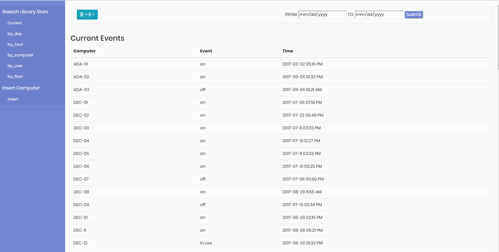
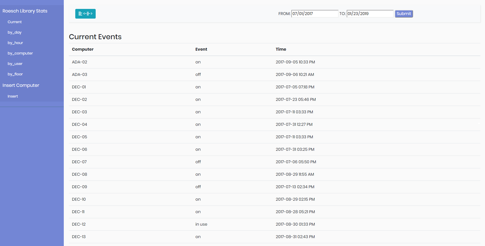
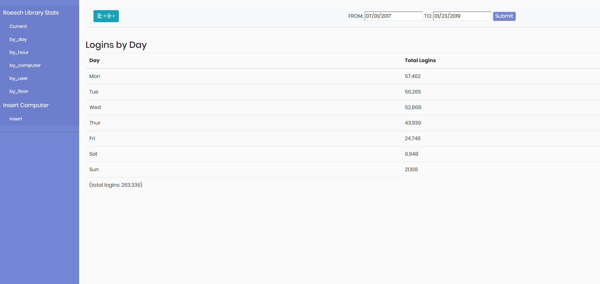
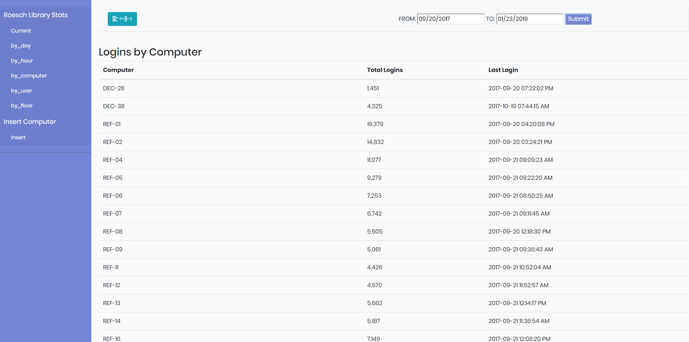
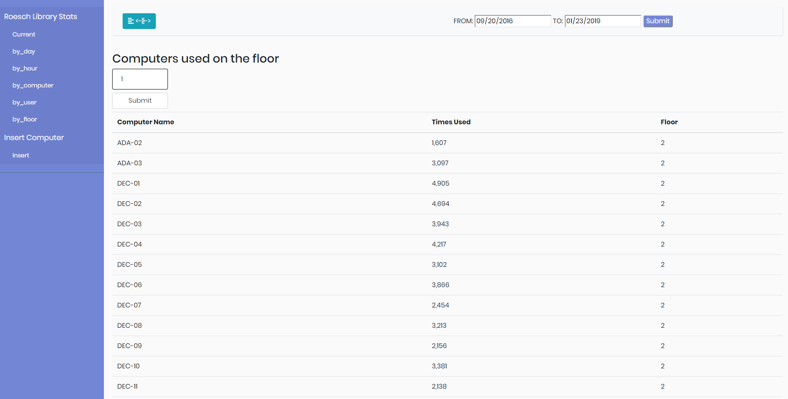
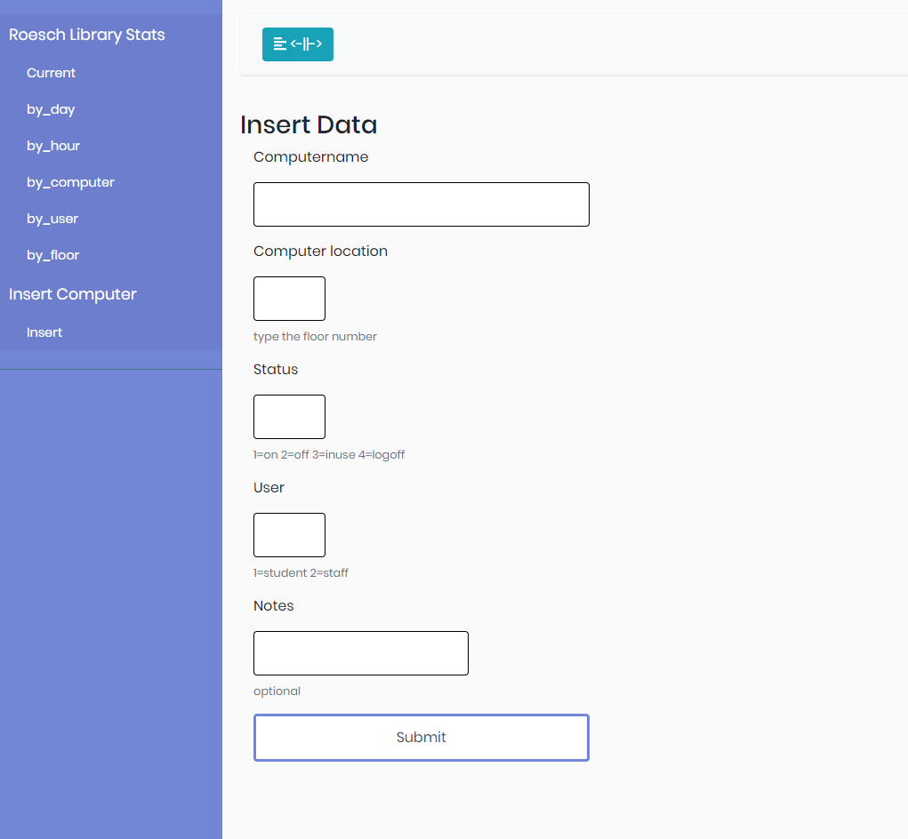

# Computer-Statistics
Project for University of Dayton

•	Webpage for showing the usage of computers in university library for each day, hour, currently used and filter the results by users who are currently using, by computer and by floor.
•	Implemented date sort functionality to display the results between the selected days
•	Written in Bootstrap, JQuery for front-end and PHP for getting the data from MySQL database.

